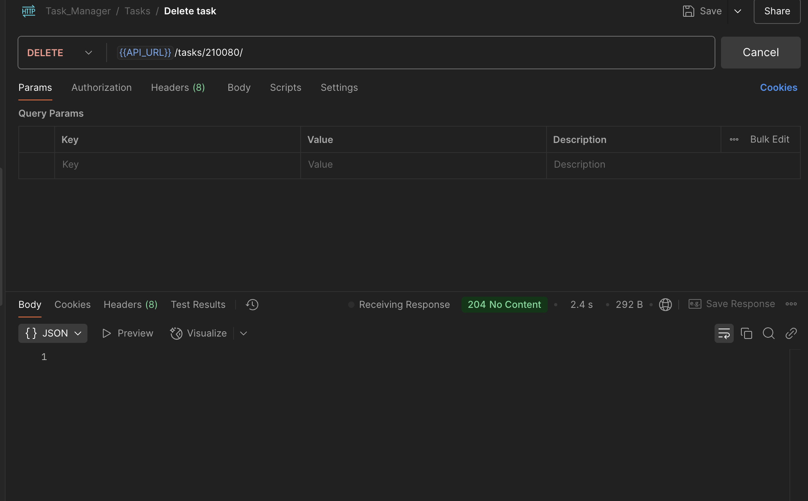

# Tratoli API Task

## API Endpoints

Below are the available API endpoints for the project:

### Authentication

- `POST /api/auth/login` - Log in to the application.
- `POST /api/auth/logout` - Log out from the application.
- `POST /api/auth/refresh-token` - Refresh the authentication token.
- `POST /api/auth/register` - Register a new user.

### User Profile

- `GET /api/detail/profile` - Get the user profile details.
- `PUT /api/detail/update-profile/` - Update the user profile details.

### API Documentation

- `/swagger` - Access the Swagger UI for interactive API documentation.
- `/redoc` - Access the ReDoc UI for alternative API documentation.

### Task Management

- `GET /api/tasks/` - Get a list of tasks.
- `GET /api/tasks/{id}/` - Get details of a specific task by its ID.
- `POST /api/tasks/` - Create a new task.
- `PUT /api/tasks/{id}/` - Update a specific task by its ID.
- `DELETE /api/tasks/{id}/` - Delete a specific task by its ID.
- `GET /api/tasks/export/` - Export the tasks.
- `GET /api/tasks/report/` - Generate a report of tasks.

## Project Structure
```bash
.
├── Dockerfile
├── docker-compose.yml
├── manage.py
├── requirements.txt
├── taskmanager
│   ├── __init__.py
│   ├── asgi.py
│   ├── celery.py
│   ├── celeryconfig.py
│   ├── settings.py
│   ├── urls.py
│   └── wsgi.py
├── tasks
│   ├── __init__.py
│   ├── admin.py
│   ├── apps.py
│   ├── consumers.py
│   ├── management
│   │   └── commands
│   │       ├── __init__.py
│   │       └── generate_tasks.py # This file generates fake records for tasks
│   ├── migrations/
│   ├── models.py
│   ├── routing.py
│   ├── serializers.py
│   ├── tasks.py
│   ├── tests.py
│   └── views.py
└── users
    ├── __init__.py
    ├── admin.py
    ├── apps.py
    ├── migrations/
    ├── models.py
    ├── serializers.py
    ├── tests.py
    └── views.py
```
## Project Setup and Installation
1. Clone the project
2. Install the docker using this  [link](https://docs.docker.com/engine/install/).
3. Run the docker container using below command:-
```bash
docker-compose up --build -d
```

## Screenshots
### API Response
- `POST /api/auth/register`

<br><br>

- `POST /api/auth/login`

<br><br>

- `POST /api/auth/refresh-token`

<br><br>

- `POST /api/auth/logout`

<br><br>

- `GET /api/detail/profile`

<br><br>

- `PUT /api/detail/update-profile`

<br><br>

- `GET /api/tasks/`

<br><br>

- `GET /api/tasks/{id}`

<br><br>

- `POST /api/tasks/`

<br><br>

- `PUT /api/tasks/{id}`

<br><br>

- `DELETE /api/tasks/{id}`

<br><br>

- `GET /api/tasks/report/`

<br><br>

- `GET /api/tasks/export/`

<br><br>

- `GET /swagger`

<br><br>

- `GET /redoc`

<br><br>

- `GET /WS`

<br><br>


### Task Creation Mail

<br><br>

### Rate Limiting

<br><br>

### Dummy Task Generation Script

<br><br>